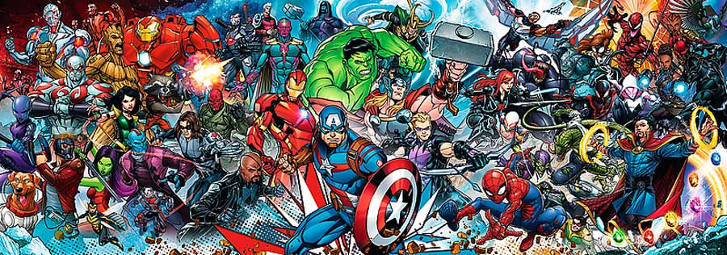

# Proyecto de Aplicación Web: ComicVerse



💡 [Idea de la aplicación](#idea-de-la-aplicación)

👥 [Audiencia objetivo](#audiencia-objetivo)

📊 [Análisis de mercado](#análisis-de-mercado)

🔑 [Funcionalidades clave](#funcionalidades-clave)

🛠️ [Tecnologías a utilizar](#tecnologías-a-utilizar)

📁 [Estructura del proyecto](#estructura-del-proyecto)

🔗 [Enlaces de interés](#enlaces-de-interés)


## 💡 Idea de la aplicación

ComicVerse es una aplicación web diseñada para los aficionados de los cómics de Marvel. Su propósito principal es proporcionar una plataforma interactiva y fácil de usar donde los usuarios puedan explorar, descubrir y seguir sus cómics, personajes, creadores y eventos favoritos del universo Marvel. La aplicación busca resolver la necesidad de tener un acceso centralizado, organizado y personalizado a la vasta información del mundo de los cómics de Marvel.

## 👥 Audiencia objetivo

La aplicación está dirigida principalmente a:

- Fans de los cómics de Marvel de todas las edades
- Coleccionistas de cómics
- Nuevos lectores que quieren explorar el universo Marvel


Estos usuarios se beneficiarán de una plataforma que les permita acceder fácilmente a información detallada, descubrir nuevo contenido y personalizar su experiencia según sus preferencias.

## 📊 Análisis de mercado

Existen varias aplicaciones y sitios web que ofrecen información sobre cómics de Marvel, como:

-> [Marvel comic](https://www.marvel.com/comics/) (sitio oficial)

-> [Comic Vine](https://comicvine.gamespot.com/)

-> [ComicBookRealm](https://comicbookrealm.com/)

Sin embargo, ComicVerse se diferencia por:
1. Enfoque exclusivo en el universo Marvel
2. Interfaz de usuario más intuitiva y moderna
3. Funciones de personalización avanzadas
4. Información relacionada (cómics, personajes, creadores y eventos)

## 🔑 Funcionalidades clave

📚**Exploración detallada de cómics:**
   - Imagen, título, descripción
   - Personajes involucrados
   - Creadores
   - Cómics relacionados

🦸‍♂️**Información completa de personajes:**
   - Imagen, nombre, biografía
   - Lista de cómics en los que aparece
   - Eventos relacionados

🎨**Perfiles de artistas/creadores:**
   - Imagen, nombre completo
   - Lista de cómics
   - Eventos en los que participan

📅**Exploración de eventos:**
   - Imagen, título, fechas de inicio y fin
   - Historia del evento
   - Próximo evento

👤**Perfil de usuario personalizable:**
   - Imagen de perfil
   - Nombre
   - Cómics favoritos
   - Creadores/atistas favoritos


## 🛠️ Tecnologías a utilizar

### Frontend: React con Vite

  React ofrece un rendimiento óptimo y una gran flexibilidad para crear interfaces de usuario interactivas. Vite proporciona una configuración rápida y un entorno de desarrollo eficiente.

### API: Marvel API

   Fuente oficial y confiable de datos sobre el universo Marvel.

### Entorno de desarrollo: Visual Studio Code
  
  Editor de código versátil con amplio soporte para React y JavaScript.

### Control de versiones: Git y GitHub
  
  Facilita el seguimiento de cambios y la colaboración en el proyecto.

### Despliegue: Netlify

   Para la implementación y alojamiento de la web.

### Base de datos: IndexedDB

   Almacenamiento de datos localmente en el navegador (almacén de configuración de usuario, de comics favoritos y de creador/artista favorito) asegurando la persistencia de la información.

### Librerías:
    
   - React Router:

     Realiza el enrutamiento de la aplicación, permitiendo crear rutas dinámicas y gestionando la navegación.
     
   - React icons:

     Librería de iconos para facilitar su uso e implementación. 

## 📁 Estructura del proyecto
```bash
src/
|-- assets/
|   |-- icons/
|-- components/
|   |-- eventos/
|   |   |-- Evento.jsx
|   |   |-- ListaEventos.jsx
|   |-- ArtistaComic.jsx
|   |-- Comic.jsx
|   |-- Footer.jsx
|   |-- FormularioContacto.jsx
|   |-- FormularioBusqueda.jsx
|   |-- Header.jsx
|   |-- ListaArtistaComic.jsx
|   |-- ListaComics.jsx
|-- pages/
|   |-- Artista.jsx
|   |-- Comic.jsx
|   |-- ConfigUsuario.jsx
|   |-- Contacto.jsx
|   |-- Evento.jsx
|   |-- Inicio.jsx
|   |-- NotFound.jsx
|   |-- Personaje.jsx
|   |-- Usuario.jsx
|-- layouts/
|   |-- LayoutPublic.jsx
|-- router/
|   |-- index.jsx
|-- styles/
|   |-- 
|-- Main.jsx
```

### Assets: 
Contiene recursos estáticos como iconos.

### Components: 
Almacena componentes reutilizables de React.
- **eventos:** Componentes específicos para la funcionalidad de eventos.
- Otros componentes como Comic, Footer, Header, y las Listas de comics, artistas y eventos, los cuales están formados por los componentes Comic, Evento, Artista que son reutilizables casi en todas las páginas de la web.
- Formularios para ser más fácil el manejo del formulario y luego llamarlo desde las páginas que los integren.
### Pages: 
Contiene componentes que representan páginas completas de la aplicación, las cuales llaman a componentes generales.
### Layouts: 
Incluye componentes de diseño, como LayoutPublic.jsx, contiene la estructura común para las páginas públicas.
### Router: 
Contiene la configuración del enrutador de la aplicación.
### Styles: 
Destinado a archivos de estilos de las páginas y componentes.
### Main.jsx: 
Punto de entrada principal de la aplicación React, contiene el enrutamiento y la página de inicio como raíz del proyecto como consecuencia.

## 🔗 Enlaces de interés

[Documentación API Marvel](https://developer.marvel.com/docs)

[Enlace a prototipo Figma](https://www.figma.com/design/OAOENSn9ywu4vSe2v8AA9P/ComicVerse?node-id=281-2&node-type=canvas&t=4doWAGlUvXtGJVqN-0)
