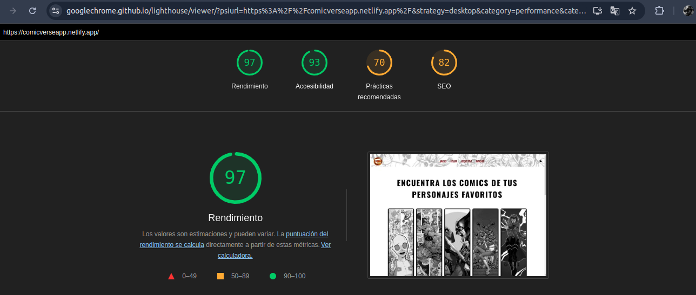
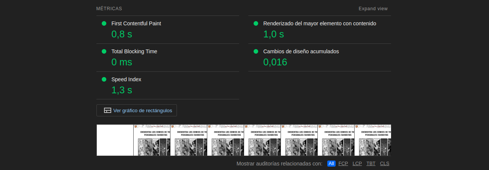
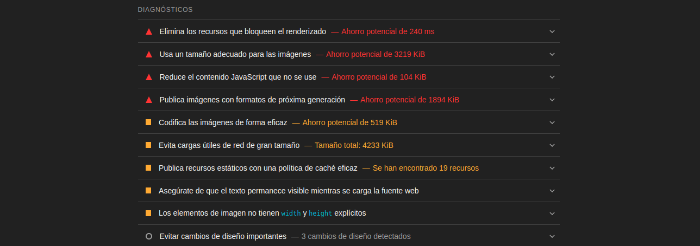
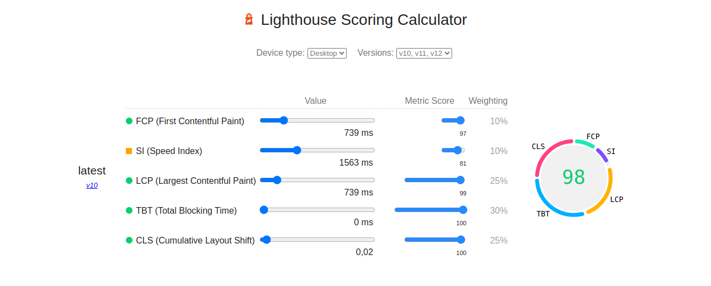
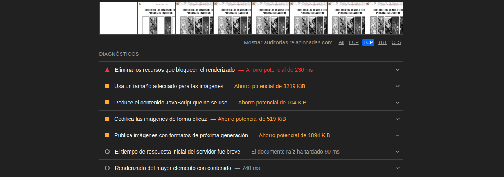
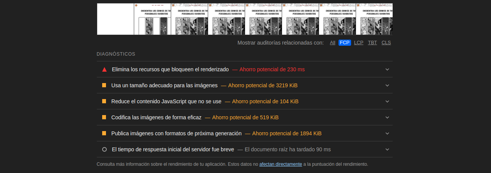

### LightHouse pruebas de renderizado

Con la extensión lighthouse hemos analizado la página, nos da mismo resultado que con PageSpeed Insights.

### Analizando los parámetros

Las recomendaciones para lcp y fcp son las mismas: 

- Largest Contentful Paint (LCP): tiempo que tarda en renderizarse el elemento más grande visible: 

- First Contentful Paint (FCP): tiempo hasta que se muestra el primer elemento visual:

 1. Mostrar los elementos de JavaScript y CSS críticos insertados y pospongas todos los que no sean esenciales.

 2. Mostrar imágenes con un tamaño adecuado para ahorrar datos móviles y mejorar el tiempo de carga.

 3. Reducir el contenido JavaScript que no se utiliza y retrase la carga de secuencias de comandos hasta que se necesite.

 4. Las imágenes optimizadas se cargan más rápido y consumen menos datos móviles.

 5. Los formatos como WebP y AVIF suelen comprimir mejor las imágenes que los formatos PNG o JPEG, lo que hace que se descarguen más rápido y consuman menos datos.

- Cumulative Layout Shift (CLS): estabilidad visual del contenido durante la carga.

 1. Especificar un ancho y una altura explícitos para reducir los cambios de diseño y mejorar el CLS

Del resto de parámetros no me ha dado resultados.

[Volver a página principal](../testing.md)
