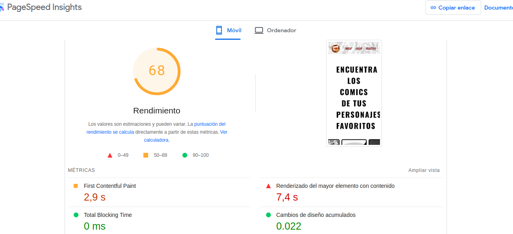
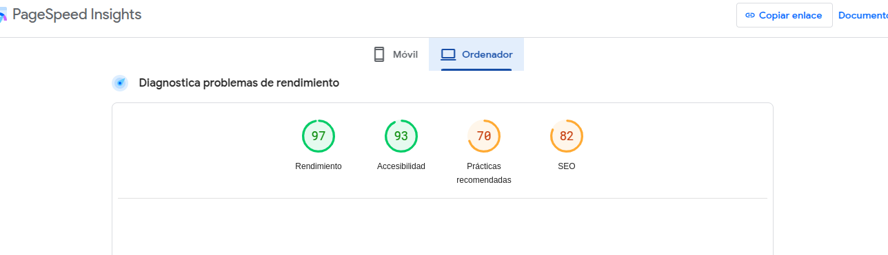
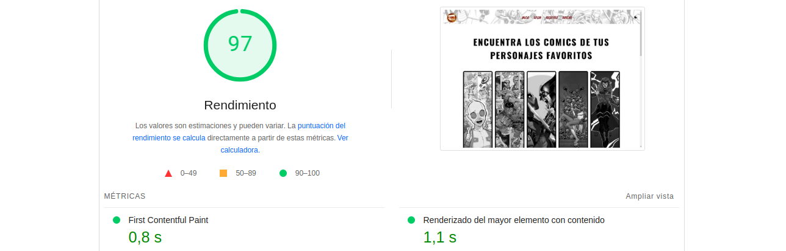
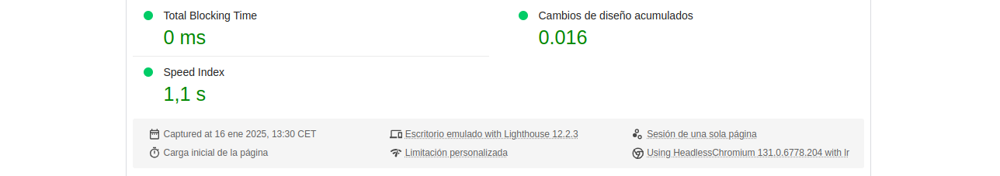
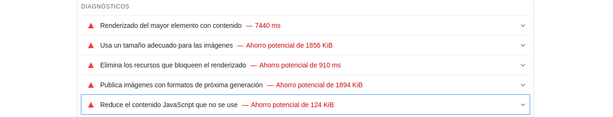
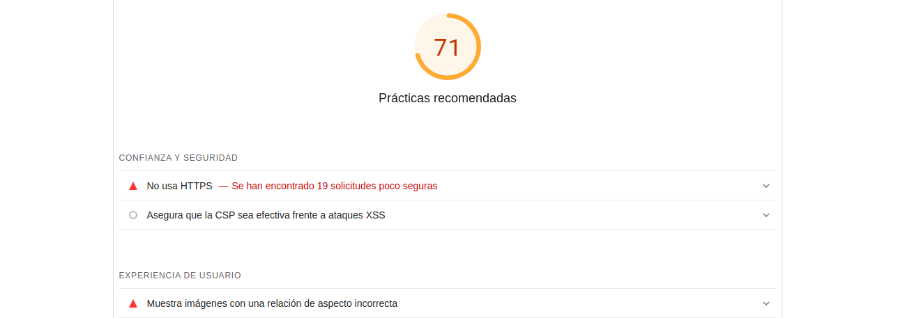

### PageSpeed Insights

Se han realizado pruebas de rendimiento de la web en comparando dispositivo móvil y ordenador, **sólo con la página de inicio** ya que la de búsqueda no muestra listado si no se busca un personaje, por lo que la prueba no me parece concluyente con respecto a la información que buscamos ya que sólo analiza un input y un botón, no el listado de cómics.

En la página de inicio si se muestran dos listados con imágenes y me parece interesante hacer el test ya que engloba lo que se busca en la actividad.

### Información en móvil

El resultado era esperado, el rendimiento es peor en dispositivos móviles y con esta prueba se ve claramente:

### Información en ordenador

#### Recomendaciones del test

Se ha recogido las de bandera roja aunque hay muchas mmás, pero son las más importantes:

- **Renderizado del mayor elemento con contenido:**

En este caso el título de inicio (h1).

El LCP mide cuándo se renderiza en la pantalla el elemento de contenido más grande del viewport. 
Esto se aproxima al momento en que el contenido principal de la página es visible para los usuarios y cuánto tarda para tenerlo en cuenta (6490 ms). 

- **Elimina los recursos que bloqueen el renderizado:**

Recomienda que muestre los elementos de JavaScript y CSS esenciales, dejando los que no lo son para mejorar el rendimiento.

- **Usar un tamaño adecuando para las imágenes:**

Para ahorrar datos móviles y mejorar el tiempo de carga en ambos dispositivos.

- **Publica las imágenes con formatos de próxima generación:**

Los formatos como WebP y AVIF suelen comprimir mejor las imágenes que los formatos PNG o JPEG, lo que hace que se descarguen más rápido y consuman menos datos.

- **Reduce el contenido JavaScript que no se use:**
Reduce el contenido JavaScript que no se use y retrasa la carga de secuencias de comandos hasta que se necesiten, usar bien el lazyLoading.

#### Más recomendaciones:

Agregar siempre al atributo *' ALT '* a las imagenes y proporcionar un contexto.

Usar siempre HTTPS en vez de HTTP por temas de seguridad.

Añadir una metadescripciń a la web para mejora del SEO.

[Volver a página principal](../testing.md)