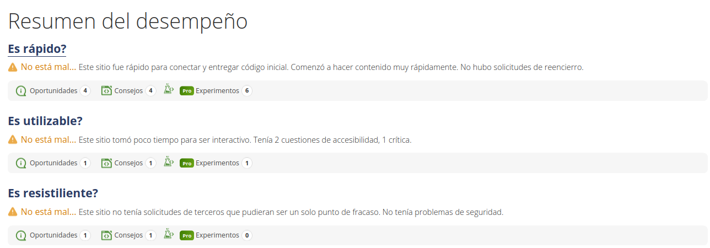

Se han realizado pruebas de rendimiento en https://www.webpagetest.org/, simulando un ordenador portátil conectado por cable usando Firefox, dando los siguientes resultados:

[Volver a página principal](../testing.md)