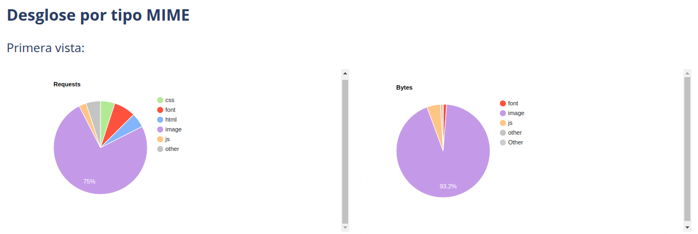
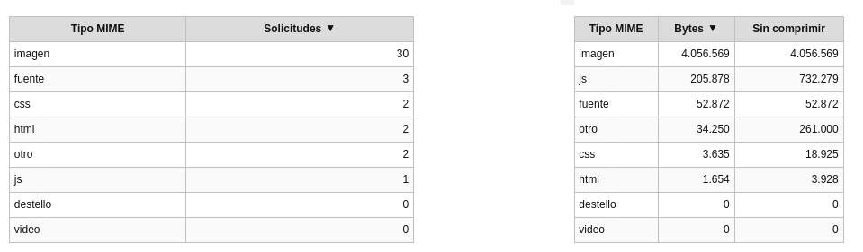
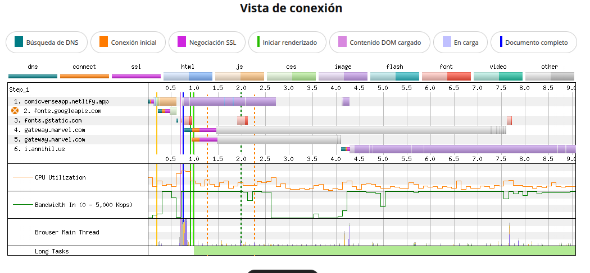

#### Desglose MIME
Basado en el desglose MIME que indica que la mayoría del contenido son imágenes, podemos concluir que este es un punto clave para mejorar el rendimiento de la web. 

[Volver a página anterior](principal.md)