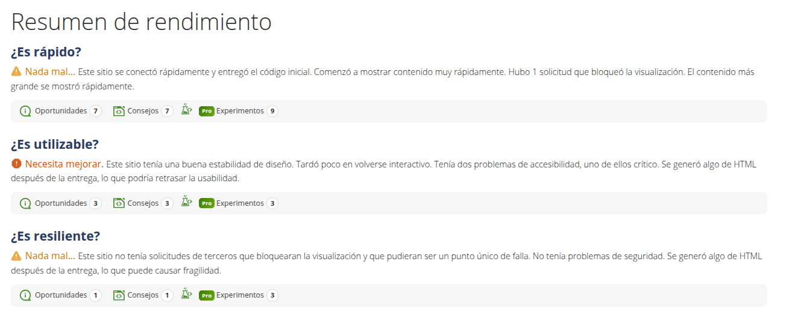

Se han realizado pruebas de rendimiento en https://www.webpagetest.org/, simulando un ordenador portatil conectado por cable usando el navegador Chrome, dando los siguientes resultados:

#### Resumen de la prueba

| Fecha y Hora | Evento | Detalles |
|--------------|--------|----------|
| 13/01/2025 11:36:25 | Prueba de inicio | Prueba creada |
| 13/01/2025 11:37:00 | Extracción de archivo | 326299 bytes, '/tmp/phpL0QUHx' a './results/25/01/13/AiDcKP/541' |
| 13/01/2025 11:37:00 | Ejecución completa | Ejecución: 2, Caché: 0, Finalización: 1, Probador: iad-us-asg-jxcq-10.10.1.83-34.21.9.50 |
| 13/01/2025 11:37:00 | Progreso | 1 de 3 pruebas completadas |
| 13/01/2025 11:37:00 | Procesamiento finalizado | Ejecución: 2, Caché: 0, Finalizado: 1, Probador: iad-us-asg-jxcq-10.10.1.83-34.21.9.50 |
| 13/01/2025 11:37:00 | Extracción de archivo | 322957 bytes, '/tmp/phpg1CVnN' a './results/25/01/13/AiDcKP/541' |
| 13/01/2025 11:37:00 | Ejecución completa | Ejecución: 3, Caché: 0, Finalización: 1, Probador: iad-us-asg-6tzf-10.10.1.121-34.21.9.50 |
| 13/01/2025 11:37:00 | Progreso | 2 de 3 pruebas completadas |
| 13/01/2025 11:37:00 | Procesamiento finalizado | Ejecución: 3, Caché: 0, Finalizado: 1, Probador: iad-us-asg-6tzf-10.10.1.121-34.21.9.50 |
| 13/01/2025 11:37:01 | Extracción de archivo | 325403 bytes, '/tmp/phpcdmWnO' a './results/25/01/13/AiDcKP/541' |
| 13/01/2025 11:37:01 | Ejecución completa | Ejecución: 1, Caché: 0, Finalización: 1, Probador: iad-us-asg-0r85-10.10.1.113-34.21.9.50 |
| 13/01/2025 11:37:01 | Progreso | 3 de 3 pruebas completadas |
| 13/01/2025 11:37:01 | Estado | Todo listo |
| 13/01/2025 11:37:01 | Procesamiento finalizado | Ejecución: 1, Caché: 0, Finalizado: 1, Probador: iad-us-asg-0r85-10.10.1.113-34.21.9.50 |
| 13/01/2025 11:37:01 | Estado | Prueba completada |
| 13/01/2025 11:37:01 | Posprocesamiento | Finalización del posprocesamiento de la prueba |
| 13/01/2025 11:37:01 | Extracción de archivo | 317097 bytes, '/tmp/php1BBymf' a './results/25/01/13/AiDcKP/541' |
| 13/01/2025 11:37:01 | Ejecución completa | Ejecución: 3, Caché: 0, Finalización: 1, Probador: iad-us-asg-cbg9-10.10.1.167-34.21.9.50 |
| 13/01/2025 11:37:01 | Progreso | 1 de 3 pruebas completadas |
| 13/01/2025 11:37:01 | Procesamiento finalizado | Ejecución: 3, Caché: 0, Finalizado: 1, Probador: iad-us-asg-cbg9-10.10.1.167-34.21.9.50 |

[Volver a página principal](../testing.md)