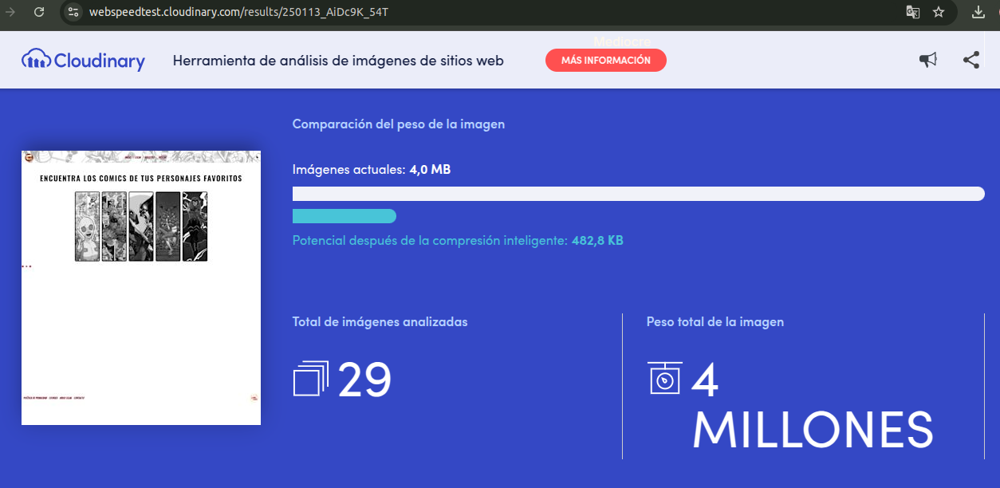
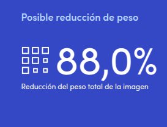

#### Analizando las imagenes

Después de ver que la web flaquea con las imagenes, hemos hecho test para ver cuanto podriamos optimizarlo:

Para optimizar el sitio, se pueden implementar estrategias de compresión de imágenes y seguir las recomendaciones de tamaño.

[Volver a página anterior](principal.md)