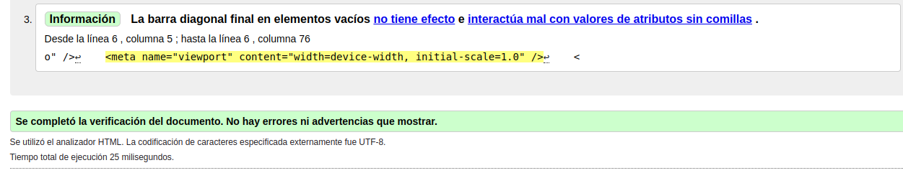
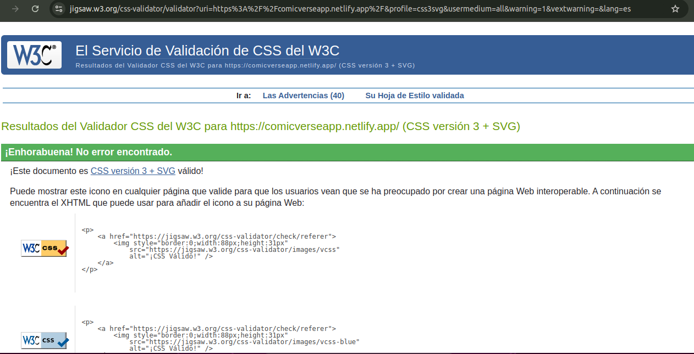

## Índice

1. [Estándares Web](#estándares-web)  
   1.1 [¿Qué son los estándares web?](#¿qué-son-los-estándares-web)  
   1.2 [Estándares web W3C](#¿cuáles-son-los-estándares-web-w3c)  
   1.3 [Factores para la comprobación de estándares web W3C](#factores-para-la-comprobación-de-estándares-web-w3c)  

2. [Calidad del Código](#calidad-del-código)  
   2.1 [Validación HTML](#validación-del-código-html)  
   2.2 [Validación CSS](#validación-de-css)  
   2.3 [Validación JavaScript](#validación-de-js)  

3. [Pruebas de Rendimiento](#pruebas-realizadas-para-rendimiento)  
   
4. [Aspectos de Usabilidad](#aspectos-de-usabilidad)  

5. [Reflexión](#reflexión)  
   5.1 [Beneficios de los estándares web para el desarrollador](#beneficios-de-los-estandares-web-de-cara-al-desarrollador)  
   5.2 [Mejor herramienta](#mejor-herramienta)  

### Estandar web
**World Wide Web Consortium**(W3C) es un consorcio internacional de organizaciones relacionadas con las tecnologías de la información. Dicha organización busca promover la evolución constante de la web, estableciendo normas que permitan su estandarización.

En años anteriores, si su empresa contaba con un sitio web, este debía ser desarrollado para cada uno de los diferentes navegadores. Es decir: si su empresa contemplaba el uso de cuatro navegadores, necesitaba desarrollar el mismo sitio web para cada uno de ellos.
Esto representaba mucho tiempo, esfuerzo y recurso de los departamentos de informática.

Es por eso que, en el año 1997, el **W3C** lanzó una iniciativa **WAI** (Web Accessibility Initiative) para lograr que se siguieran estándares, facilitando con ello la accesibilidad web.

### ¿Qué son los estándares web?

Se trata de protocolos, lenguajes y tecnologías interoperativas que, de manera internacional, guían a la Web hacia su máximo potencial.
### ¿Cuáles son los estándares web W3C?

Entre los estándares web W3C más usados y conocidos, es posible encontrar:

- **Javascript**, el cual otorga dinamismo y funcionalidad a la web.
- **HTML** por sus siglas en inglés “_HyperText Markup Language_”. Define y presenta la estructura de los documentos web.
- **CSS**, por sus siglas en inglés “_Cascading Style Sheets_”. Permite la asignación de estilos para la correcta representación de los documentos.
- **XML**, por sus siglas en inglés “_eXtensible Markup Language_”. Cuya función es la de base para un número extenso de tecnologías.

### Factores para la comprobación de estándares web W3C

## Calidad del código
En nuestro caso  HTML, CSS y JavaScript.

Hemos realizado diferentes pruebas para comprobar que la web cumple con los estandares:

#### **Validación del código HTML:**
En la web https://validator.w3.org hemos ingresado el inicio de nuestra web para que la analice. Es la pantalla que más contenido contiene y la que parece más interesante de analizar. 
Los resultados han sido positivos y no muestra ningún error, sólo alguna información a tener en cuenta:

#### **Validación de CSS:**
En la web https://jigsaw.w3.org/css-validator hemos ingresado la URL del inicio de nuestra página para que analice si cumple los estandares CSS, obteniendo un resultado positivo sin ningún error:

Pendiente de añadir el icono de página web interoperable que nos han facilitado.

#### **Validación de JS:**
Para validar el código JS se ha usado https://www.minifier.org/javascript-validator, copiando y pegando el código de la página de inicio directamente en la página y nos ha devuelto estos errores a tener en cuenta para un estandar de JS óptimo:

| Línea | Columna | Fuente                                                                                                                   | Mensaje                                       |
| ----- | ------- | ------------------------------------------------------------------------------------------------------------------------ | --------------------------------------------- |
| 98    | 42      | si (error) devuelve 
Error: {error}
;                                                                               | indefinido                                    |
| 9     | 1       | * Página principal de la aplicación que maneja la carga de cómics y eventos aleatorios desde la API de Marvel.           | La línea tiene más de 80 caracteres.          |
| 10    | 2       | *                                                                                                                        | Espacio final inesperado.                     |
| 11    | 1       | * @returns {JSX.Element} El componente renderizado que muestra una galería de imágenes,                                  | La línea tiene más de 80 caracteres.          |
| 11    | 88      | * @returns {JSX.Element} El componente renderizado que muestra una galería de imágenes,                                  | Espacio final inesperado.                     |
| 32    | 1       | deje url = `https://gateway.marvel.com/v1/public/comics?ts=1&apikey=${apiKey}&hash=${hash}`;                             | La línea tiene más de 80 caracteres.          |
| 35    | 1       | si (!response.ok) arroja nuevo Error(`Error al obtener los cómics: ${response.status}`);                                 | La línea tiene más de 80 caracteres.          |
| 49    | 1       | constante respuesta = await fetch(`https://gateway.marvel.com:443/v1/public/events?ts=1&apikey=${apiKey}&hash=${hash}`); | La línea tiene más de 80 caracteres.          |
| 50    | 1       | si (!response.ok) arroja un nuevo Error(`Error al obtener eventos: ${response.status}`);                                 | La línea tiene más de 80 caracteres.          |
| 51    | 5       |                                                                                                                          | Espacio final inesperado.                     |
| 63    | 18      | buscarComics();                                                                                                          | Espacio final inesperado.                     |
| 73    | 29      | ventana.addEventListener('scroll', handleScroll);                                                                        | Utilice comillas dobles, no comillas simples. |
| 75    | 45      | return() => ventana.removeEventListener('scroll', handleScroll);                                                         | Utilice comillas dobles, no comillas simples. |
| 81    | 1       | const currentEvents = eventsData.length > 0 ? eventsData.slice(índiceDelPrimerEvento, índiceDelÚltimoEvento) : [];       | La línea tiene más de 80 caracteres.          |
| 88    | 23      | si (dirección === 'siguiente' && páginaActual < PáginasTotales) {                                                        | Utilice comillas dobles, no comillas simples. |
| 90    | 30      | } de lo contrario si (dirección === 'prev' && páginaActual > 1) {                                                        | Utilice comillas dobles, no comillas simples. |
| 94    | 1       |                                                                                                                          | Espacio final inesperado.                     |

## Pruebas realizadas para rendimiento

#### Pruebas en WebPages Test
[Web Pages Test: navegador Chrome, desktop](./rendimientoWebPageTest/principal.md)

[Web Pages Test: navegador Firefox, movil](./rendimientoWebPageTest/movilfirefox.md)

[Web Pages Test: navegador Firefox, desktop](./rendimientoWebPageTest/desktopFirefox.md)

**Más pruebas realizadas para mejorar el rendimiento en WebPage Test:**

- [Desglose MIME](./rendimientoWebPageTest/mime.md)

- [Pruebas de imagenes de la web](./rendimientoWebPageTest/pruebaImagenes.md)

- [Mejoras para el rendimiento de la web](./rendimientoWebPageTest/mejoras.md)

#### Pruebas en PageSpeed Insights
[PageSpeed Insights](./pruebasPageSpeed/pruebaPageSpeed.md)

#### Pruebas en Light House
[Light House](./pruebasLightHouse/pruebaLightHouse.md)

#### Pruebas con Ghost Inspector
[Ghost Inspector](./pruebaGhostInspector/pruebaGhosthInspector.md)

## Aspectos de usabilidad
### Web intuitiva
Menús visibles y fáciles de navegar, así como los formularios bien elaborados son cosas que hemos tenido cuenta en el diseño y se han llevado a cabo.

### Facilidad de navegación
Cumple con navegación con ratón y tabulador, pero no está adaptada a pantalla táctil.

### Compatible con todos los dispositivos
En la web ha fallado el diseño responsive, que al llegar a cierto tamaño no termina de "acoplarse" adecuadamente el contenido, además su modo oscuro no funciona adecuadamente y le falta opciones de traducción para aquellas personas con dificultades de vista.

### Calidad del contenido y su presentación
Mostrar la información de manera clara e intuitiva para una fácil navegación del usuario.

## Reflexión 
Es importante cumplir con los estándares para que todos los desarrolladores sigan unas pautas y pueda extender el uso de su web a otros dispositivos sin problema. 

Creo que la navegación por la web si es fácil, intuitiva y atractiva, la velocidad de carga seguramente se pueda acelerar más comprimiendo las imágenes que devuelva la API.

La usabilidad es tan importante como que tenga un diseño atractivo y "limpio", pues es lo que hará que los usuarios usen nuestra web y no se aburran o se cansen y se dirijan a otras web más intuitivas y atractivas. Aquí también entra en juego el rendimiento, pues si yo estoy usando una web que tarda mucho en cargar cada vez que la uso no voy a queres usarla más. 

Vivimos en una sociedad donde la falta de paciencia es abundante y el ritmo de vida muy elevado, debemos facilitar en lo que podamos el servicio ofrecido.

#### Beneficios de los estandares web de cara al desarrollador
- Reducción el tiempo requerido para el desarrollo.
- Facilidad en el mantenimiento del sitio.
- Simplificación del código fuente.
- Es una herramienta para su estrategia SEO.

#### Mejor herramienta
En cuanto a las herramientas de testeo que más me han gustado, me quedaría con PageSpeed Insights por su facilidad de uso y claridad de resultados y con Gosth Inspector porque se puede grabar el vídeo y crea la prueba directamente, lo cuál es cómodo pero es de pago.
